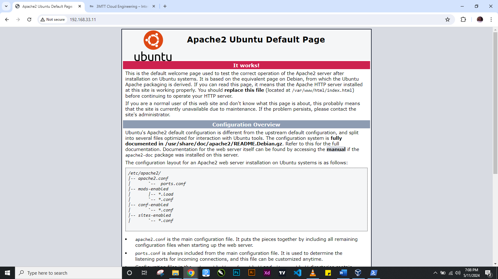

Our Apache2 server is running successfully

To verify that the Laravel application is accessible through the Slave node's IP address, i use curl to access the application through the Slave node's IP address.

Created a Vagrantfile to provision two Ubuntu based servers, "Master" and "Slave" and Configured networking to ensure communication between the two servers.
